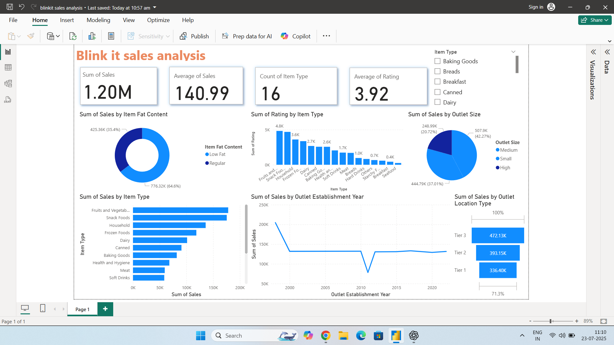

# 🛒 Blinkit Grocery Dashboard – Power BI Project

This Power BI project explores grocery product data from Blinkit (formerly Grofers), focusing on product ratings, pricing, and fat content. The dashboard helps uncover key business insights like top-rated products, category breakdowns, and customer preferences.

---

## 📌 Project Objective

To build an interactive dashboard that allows users to analyze:
- Top-rated grocery products
- Average sales prices
- Product distribution by fat content
- Relationship between fat content and customer ratings

---

## 📊 Dashboard Insights

Here are a few insights observed from the dashboard:

- 🥇 **Low Fat products** are the most common and tend to have higher ratings.
- 💰 **Most top-rated items fall in the ₹30–₹40 price range**, making them affordable and popular.
- 🍽️ **Regular Fat items** are fewer in number but may have varied ratings.
- ⭐ The dashboard highlights **which categories/products stand out**, helping store managers or marketers to promote top performers.

---

## 🧠 What I Learned

- How to import, clean, and transform data using Power BI.
- Creating KPI cards, bar charts, pie charts, and slicers for interactivity.
- Understanding user preferences from data visuals.
- Designing a functional dashboard layout and using filters for storytelling.

---

## 🛠️ Tools & Skills Used

- Power BI Desktop  
- Data Visualization  
- DAX (basic)  
- Data Cleaning  
- Dashboard Design  
- Slicers and Interactions  

---

## 🖼️ Dashboard Preview

---

## 🚀 How to Use

1. Download the `.pbix` file from this repo.
2. Open in Power BI Desktop.
3. Interact with slicers to explore insights.

---

## 📂 Dataset Source

The dataset was provided as part of a practice assignment and may be simulated or extracted from Blinkit's product listings.

---

## 📌 Future Improvements

- Add better background styling and consistent theme.
- Use tooltips for enhanced storytelling.
- Add a dashboard summary for non-technical users.

---

